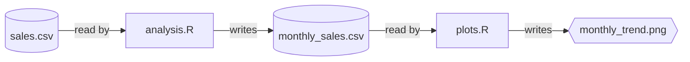

# Bakepipe

Bakepipe is an R library that turns your script-based workflows into reproducible pipelines.

## Motivation

When analysing data in R you often start out with everything in a single script. As the analysis broadens, you might split it into multiple scripts. One script might read in the data, clean it up, maybe merge multiple datasets. Statistics are run in another script, while plots are generated in a third. Each script writes data to be used by another script. This is all fine, but eventually it gets out of hand. You need to manually run the scripts in the right order, manually tracking the dependencies.

Bakepipe helps you manage this by tracking the dependencies between scripts and running them in the right order.

## Example

In our example, we have the following files:

| File | Description |
|------|-------------|
| `sales.csv` | Daily sales data with product categories and revenue |
| `analysis.R` | Calculates monthly sales summaries |
| `plots.R` | Creates a monthly trend plot |

The workflow looks like this:



Here is what the scripts look like:

```r
# analysis.R
library(bakepipe)
library(dplyr)

sales <- read.csv(file_in("sales.csv"))
monthly <- sales %>% 
  group_by(month, category) %>% 
  summarize(revenue = sum(revenue))
write.csv(monthly, file_out("monthly_sales.csv"), row.names = FALSE)
```

```r
# plots.R
library(bakepipe)
library(ggplot2)

monthly <- read.csv(file_in("monthly_sales.csv"))
ggplot(monthly, aes(month, revenue, color = category)) + 
  geom_line() +
  ggsave(file_out("monthly_trend.png"))
```

`file_in` and `file_out` are used to mark the input and output of the script. They both return the path to the file, so they can be used when reading or writing the file. They don't actually read or write files - they just mark dependencies so Bakepipe can figure out what needs to run when.

```r
bakepipe::run()
```

This will execute your scripts in the right order and tell you which files were created.

## API

### Mark input

To mark a file as input, use `bakepipe::file_in("path/to/file")`. `file_in(path)`
returns `path`, so it can be used when reading the file:

```r
data <- read.csv(bakepipe::file_in("data.csv"))
```

### Mark output

To mark a file as output, use `bakepipe::file_out("path/to/file")`. `file_out(path)`
returns `path`, so it can be used when writing the file:

```r
write.csv(data, bakepipe::file_out("data.csv"))
```

### Run pipeline

To run the pipeline, use `bakepipe::run()`. This will run the pipeline, and
return a list of the files that were created.

```r
bakepipe::run()
```

### Show pipeline

To show the pipeline, use `bakepipe::show()`. This will show the dependencies
between the files.

```r
bakepipe::show()
```

## Frequently asked questions

### How does Bakepipe detect dependencies?

Bakepipe detects dependencies through static analysis of your R scripts, looking for `file_in` and `file_out` calls. It parses the scripts without executing them to build a graph of the dependencies, which it then uses to determine the correct execution order.

### How does Bakepipe compare to other pipeline tools?

I want to preface this comparison by saying that Bakepipe is much more limited in scope than other pipeline tools. It's not a replacement for tools like Snakemake or Nextflow, but rather a tool for simple workflows that don't need the complexity of those tools. Yet, I want to highlight some of the features that make Bakepipe unique.

#### Snakemake

With Snakemake, you would define the workflow from the walkthrough above as follows:

```yaml
rule all: 
    input: "plot1.png", "plot2.png"

rule analysis:
    input: "data.csv"
    output: "analysis.csv"
    shell: "Rscript analysis.R"

rule plots:
    input: "analysis.csv"
    output: "plot1.png", "plot2.png"
    shell: "Rscript plots.R"
```

And to run the pipeline, you would use the following command:

```bash
snakemake
```

Compared with Bakepipe, I think this adds friction. You need to do double bookkeeping, manually keeping the Snakefile and the scripts in sync.

#### targets

To implement the same workflow in targets, you would need to refactor the scripts into functions, and then use the `tar_target` function to define the targets.

```r
# functions.R

get_data <- function(file) {
    read.csv(file)
}

analyze <- function(data) {
    table(data)
}

plot1 <- function(data) {
    plot <- ggplot(data, aes(x = variable, y = value)) + geom_point()
    ggsave("plot1.png", plot)
}

plot2 <- function(data) {
    ggplot(data, aes(x = variable, y = value)) + geom_point()
    ggsave("plot2.png")
}
```

```r
# _targets.R

library(targets)

tar_source()

list(
    tar_target(file, "data.csv", format = "file"),
    tar_target(data, get_data(file)),
    tar_target(analysis, analyze(data)),
    tar_target(plot1, plot1(analysis)),
    tar_target(plot2, plot2(analysis)),
)
```

In other words, to use targets, you need to abandon your script based workflow, and start writing functions. This in itself is not really a big change, worst case you could just wrap each script in a function. But in the process, you lose some of the advantages of a script based workflow, namely the iterative and interactive development.
