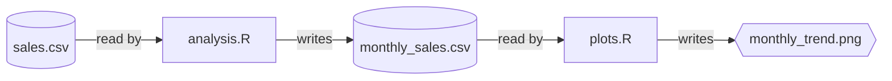

# Bakepipe

Bakepipe is an R library that turns your script-based workflows into reproducible pipelines. It's designed for scientists and analysts who use R and prefer to keep their workflows in scripts, but need better management of file dependencies.

## Table of Contents

- [Motivation](#motivation)
- [Quick Start](#quick-start)
  - [Installation](#installation)
  - [Your First Pipeline](#your-first-pipeline)
- [Example](#example)
- [API](#api)
  - [Mark input](#mark-input)
  - [Mark output](#mark-output)
  - [Run pipeline](#run-pipeline)
  - [Show pipeline status](#show-pipeline-status)
- [Frequently asked questions](#frequently-asked-questions)
  - [How is script execution order determined?](#how-is-script-execution-order-determined)
  - [Are outputs cached?](#are-outputs-cached)
  - [How does Bakepipe compare to other pipeline tools?](#how-does-bakepipe-compare-to-other-pipeline-tools)

## Motivation

When analyzing data in R, you often start with everything in a single script. As the analysis broadens, you might split it into multiple scripts. One script might read in the data, clean it up, maybe merge multiple datasets. Statistics are run in another script, while plots are generated in a third. Each script writes data to be used by another script. This is all fine, but eventually it gets out of hand. You need to manually run the scripts in the right order, manually tracking these file dependencies. This manual tracking can lead to errors, forgotten steps, and headaches, especially when sharing your analysis with colleagues.

Bakepipe helps you manage this by automatically determining the execution order of your scripts based on their file inputs and outputs. It lets you maintain your script-based workflow, avoiding the need to refactor into functions or learn complex new syntaxes.

## Quick Start

### Installation

```r
# Install from GitHub using devtools
devtools::install_github("vangberg/bakepipe")
```

### Your First Pipeline

1.  **Create project root marker:** Create an empty `_bakepipe.R` file in your project root directory.
2.  **Mark file relationships:** In your R scripts, use `file_in()` and `file_out()` to specify input and output files.
3.  **Run:** From your R console or RStudio, simply call `bakepipe::run()`.

Bakepipe will detect these file relationships and execute all your scripts in the correct order.

## Example

In our example, we have the following files:

| File         | Description                                          |
| ------------ | ---------------------------------------------------- |
| `sales.csv`  | Daily sales data with product categories and revenue |
| `analysis.R` | Calculates monthly sales summaries                   |
| `plots.R`    | Creates a monthly trend plot                         |

The workflow looks like this:



Here is what the scripts look like:

```r
# analysis.R
library(bakepipe)
library(dplyr)

sales <- read.csv(file_in("sales.csv")) # Input file
monthly <- sales %>%
  group_by(month, category) %>%
  summarize(revenue = sum(revenue))
write.csv(monthly, file_out("monthly_sales.csv")) # Output file
```

```r
# plots.R
library(bakepipe)
library(ggplot2)

monthly <- read.csv(file_in("monthly_sales.csv")) # Input file
ggplot(monthly, aes(month, revenue, color = category)) +
  geom_line() +
  ggsave(file_out("monthly_trend.png")) # Output file
```

`file_in` and `file_out` are used to mark the input and output of the script. They both return the path to the file, so they can be used directly when reading or writing. They don't actually read or write files themselves – they just mark file relationships so Bakepipe can figure out what needs to run when. This works seamlessly with any R data type or file format (e.g., `.csv`, `.rds`, `.fst`).

To execute your pipeline:

```r
bakepipe::run()
```

This will execute all your scripts in the right order every time it's called, and tell you which files were created.

## API

### Mark input

To mark a file as input, use `bakepipe::file_in("path/to/file")`. `file_in(path)` returns `path`, so it can be used directly when reading the file:

```r
data <- read.csv(bakepipe::file_in("data.csv"))
```

### Mark output

To mark a file as output, use `bakepipe::file_out("path/to/file")`. `file_out(path)` returns `path`, so it can be used directly when writing the file:

```r
write.csv(data, bakepipe::file_out("data.csv"))
```

### Run pipeline

To run the pipeline, use `bakepipe::run()`. This will execute all scripts in the pipeline graph in their determined topological order, and return a list of the files that were created or updated. If a script fails, Bakepipe stops execution and provides R's standard error messages, allowing for easy debugging.

```r
bakepipe::run()
```

### Show pipeline status

To show the pipeline, use `bakepipe::status()`. This will display a textual representation of the input/output relationships between your files in the console, helping you visualize your workflow.

```r
bakepipe::status()
```

## Frequently asked questions

### How is script execution order determined?

Bakepipe determines the correct execution order through static analysis of your R scripts, looking for `file_in` and `file_out` calls. It parses the scripts without executing them to build an execution graph, which it then uses to determine the proper sequence. This static analysis means you don't need to refactor your scripts into functions or drastically change your script structure beyond adding the `file_in()` and `file_out()` calls.
