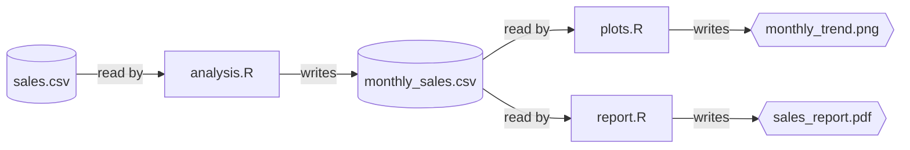

# Bakepipe

Bakepipe is an R library that turns your script-based workflows into
reproducible pipelines. It’s designed for scientists and analysts who
use R and prefer to keep their workflows in scripts, but need better
management of file dependencies.

Under the hood, Bakepipe uses
[targets](https://docs.ropensci.org/targets/) to manage your pipeline —
much like how [jj](https://github.com/martinvonz/jj) is built on git.
Bakepipe provides a simpler, more accessible interface to pipeline
management without requiring you to refactor your scripts into
functions.

**Key features:**

- **Automatic dependency detection** - determines script execution order
  from
  [`file_in()`](https://vangberg.github.io/bakepipe/reference/file_in.md)
  and
  [`file_out()`](https://vangberg.github.io/bakepipe/reference/file_out.md)
  calls
- **Incremental execution** - only re-runs scripts when they or their
  dependencies change
- **Script-based workflow** - no need to refactor existing code into
  functions

## Table of Contents

- [Motivation](#motivation)
- [Quick Start](#quick-start)
  - [Installation](#installation)
  - [Your First Pipeline](#your-first-pipeline)
- [Example](#example)
- [API](#api)
  - [Mark external input](#mark-external-input)
  - [Mark internal input](#mark-internal-input)
  - [Mark output](#mark-output)
  - [Run pipeline](#run-pipeline)
  - [Show pipeline status](#show-pipeline-status)
- [Frequently asked questions](#frequently-asked-questions)
  - [How is script execution order
    determined?](#how-is-script-execution-order-determined)
  - [Are outputs cached?](#are-outputs-cached)
  - [How does Bakepipe compare to other pipeline
    tools?](#how-does-bakepipe-compare-to-other-pipeline-tools)

## Motivation

When analyzing data in R, you often start with everything in a single
script. As the analysis broadens, you might split it into multiple
scripts. One script might read in the data, clean it up, maybe merge
multiple datasets. Statistics are run in another script, while plots are
generated in a third. Each script writes data to be used by another
script. This is all fine, but eventually it gets out of hand. You need
to manually run the scripts in the right order, manually tracking these
file dependencies. This manual tracking can lead to errors, forgotten
steps, and headaches, especially when sharing your analysis with
colleagues.

Bakepipe helps you manage this by automatically determining the
execution order of your scripts based on their file inputs and outputs.
It lets you maintain your script-based workflow, avoiding the need to
refactor into functions or learn complex new syntaxes.

## Quick Start

### Installation

``` r
# Install from GitHub using devtools
devtools::install_github("vangberg/bakepipe")
```

### Your First Pipeline

1.  **Create project root marker:** Create an empty `_bakepipe.R` file
    in your project root directory.
2.  **Mark file relationships:** In your R scripts, use
    [`external_in()`](https://vangberg.github.io/bakepipe/reference/external_in.md)
    for external files,
    [`file_in()`](https://vangberg.github.io/bakepipe/reference/file_in.md)
    for pipeline-internal files, and
    [`file_out()`](https://vangberg.github.io/bakepipe/reference/file_out.md)
    to specify output files.
3.  **Run:** From your R console or RStudio, simply call
    [`bakepipe::run()`](https://vangberg.github.io/bakepipe/reference/run.md).

Bakepipe will detect these file relationships and execute all your
scripts in the correct order. On subsequent runs, only scripts with
changes or stale dependencies will be re-executed, making your pipeline
runs much faster.

## Example

In our example, we have the following files:

| File         | Description                                          |
|--------------|------------------------------------------------------|
| `sales.csv`  | Daily sales data with product categories and revenue |
| `analysis.R` | Calculates monthly sales summaries                   |
| `plots.R`    | Creates a monthly trend plot                         |
| `report.R`   | Generates a PDF report from the monthly data         |

The workflow looks like this:



Here is what the scripts look like:

``` r
# analysis.R
library(bakepipe)
library(dplyr)

sales <- read.csv(external_in("sales.csv")) # External input file
monthly <- sales %>%
  group_by(month, category) %>%
  summarize(revenue = sum(revenue))
write.csv(monthly, file_out("monthly_sales.csv")) # Output file
```

``` r
# plots.R
library(bakepipe)
library(ggplot2)

monthly <- read.csv(file_in("monthly_sales.csv")) # Input file
ggplot(monthly, aes(month, revenue, color = category)) +
  geom_line() +
  ggsave(file_out("monthly_trend.png")) # Output file
```

``` r
# report.R
library(bakepipe)
library(rmarkdown)

monthly <- read.csv(file_in("monthly_sales.csv")) # Input file
render("report_template.Rmd", 
       output_file = file_out("sales_report.pdf"),
       params = list(data = monthly))
```

`external_in`, `file_in` and `file_out` are used to mark the input and
output of the script. They all return the path to the file, so they can
be used directly when reading or writing. They don’t actually read or
write files themselves – they just mark file relationships so Bakepipe
can figure out what needs to run when. This works seamlessly with any R
data type or file format (e.g., `.csv`, `.rds`, `.fst`).

To execute your pipeline:

``` r
bakepipe::run()
```

This will execute all your scripts in the right order every time it’s
called, and tell you which files were created.

## API

### Mark external input

To mark a file as external input that is provided by the user (not
produced by any script in the pipeline), use
`bakepipe::external_in("path/to/file")`. `external_in(path)` returns
`path`, so it can be used directly when reading the file:

``` r
raw_data <- read.csv(bakepipe::external_in("raw_data.csv"))
config <- readRDS(bakepipe::external_in("config.rds"))
```

Use
[`external_in()`](https://vangberg.github.io/bakepipe/reference/external_in.md)
for files like raw datasets, configuration files, or any input that
exists outside your pipeline’s processing workflow.

### Mark internal input

To mark a file as input that is produced by another script in the
pipeline, use `bakepipe::file_in("path/to/file")`. `file_in(path)`
returns `path`, so it can be used directly when reading the file:

``` r
data <- read.csv(bakepipe::file_in("data.csv"))
```

### Mark output

To mark a file as output, use `bakepipe::file_out("path/to/file")`.
`file_out(path)` returns `path`, so it can be used directly when writing
the file:

``` r
write.csv(data, bakepipe::file_out("data.csv"))
```

### Run pipeline

To run the pipeline, use
[`bakepipe::run()`](https://vangberg.github.io/bakepipe/reference/run.md).
This will execute all scripts in the pipeline graph in their determined
topological order, and return a list of the files that were created or
updated. If a script fails, Bakepipe stops execution and provides R’s
standard error messages, allowing for easy debugging.

``` r
bakepipe::run()
```

### Show pipeline status

To show the pipeline, use
[`bakepipe::status()`](https://vangberg.github.io/bakepipe/reference/status.md).
This will display a textual representation of the input/output
relationships between your files in the console, helping you visualize
your workflow.

``` r
bakepipe::status()
```

## Frequently asked questions

### How is script execution order determined?

Bakepipe determines the correct execution order through static analysis
of your R scripts, looking for `external_in`, `file_in` and `file_out`
calls. It parses the scripts without executing them to build an
execution graph, which it then uses to determine the proper sequence.
This static analysis means you don’t need to refactor your scripts into
functions or drastically change your script structure beyond adding the
[`external_in()`](https://vangberg.github.io/bakepipe/reference/external_in.md),
[`file_in()`](https://vangberg.github.io/bakepipe/reference/file_in.md)
and
[`file_out()`](https://vangberg.github.io/bakepipe/reference/file_out.md)
calls.

### Are outputs cached?

Yes! Bakepipe automatically performs incremental execution using the
targets backend to track file metadata. After the first run, Bakepipe
will only re-run scripts that are “stale” - meaning either:

- The script itself has been modified
- Any of the script’s input files have been modified
- Any upstream dependencies have been modified

This makes subsequent runs much faster, as only the necessary scripts
are executed. Fresh scripts are skipped with a visual indicator showing
they’re up to date. The targets metadata is stored in the `_targets/`
directory (which you should add to `.gitignore`).

### How does Bakepipe compare to other pipeline tools?

I want to preface this comparison by saying that Bakepipe is much more
limited in scope than other pipeline tools. It’s not a replacement for
tools like Snakemake or Nextflow, but rather a tool for simple workflows
that don’t need the complexity of those tools. Yet, I want to highlight
some of the features that make Bakepipe unique.

#### Snakemake

With Snakemake, you would define the workflow from the walkthrough above
as follows:

``` yaml
rule all:
    input: "monthly_trend.png", "sales_report.pdf"

rule analysis:
    input: "sales.csv"
    output: "monthly_sales.csv"
    shell: "Rscript analysis.R"

rule plots:
    input: "monthly_sales.csv"
    output: "monthly_trend.png"
    shell: "Rscript plots.R"

rule report:
    input: "monthly_sales.csv"
    output: "sales_report.pdf"
    shell: "Rscript report.R"
```

And to run the pipeline, you would use the following command:

``` bash
snakemake
```

Compared with Bakepipe, I think this adds friction. You need to do
double bookkeeping, manually keeping the Snakefile and the scripts in
sync.

#### targets

To implement the same workflow in
[targets](https://docs.ropensci.org/targets/), you would need to
refactor the scripts into functions, and then use the `tar_target`
function to define the targets.

``` r
# functions.R

get_sales_data <- function(file) {
    read.csv(file)
}

analyze_sales <- function(data) {
    data %>%
        group_by(month, category) %>%
        summarize(revenue = sum(revenue))
}

create_trend_plot <- function(data) {
    plot <- ggplot(data, aes(month, revenue, color = category)) + geom_line()
    ggsave("monthly_trend.png", plot)
    "monthly_trend.png"
}

generate_report <- function(data) {
    render("report_template.Rmd", 
           output_file = "sales_report.pdf",
           params = list(data = data))
    "sales_report.pdf"
}
```

``` r
# _targets.R

library(targets)

tar_source()

list(
    tar_target(sales_file, "sales.csv", format = "file"),
    tar_target(sales_data, get_sales_data(sales_file)),
    tar_target(monthly_sales, analyze_sales(sales_data)),
    tar_target(trend_plot, create_trend_plot(monthly_sales), format = "file"),
    tar_target(report_pdf, generate_report(monthly_sales), format = "file")
)
```

In other words, to use `targets`, you need to abandon your script-based
workflow and start writing functions. This in itself is not really a big
change; worst case you could just wrap each script in a function. But in
the process, you lose some of the advantages of a script-based workflow,
namely the iterative and interactive development that R users often rely
on, which makes e.g. debugging more difficult, something the [targets
package
acknowledges](https://books.ropensci.org/targets/debugging.html).
